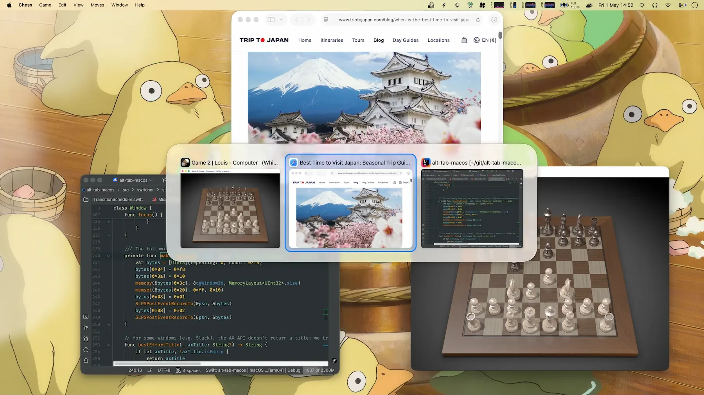

<div align="center">

# Ⓐ AltTab — Community & Unchained

**The power of Windows alt-tab, on macOS. No Pro tier. No paywall. No trial clock. No begging.**

[](docs/readme/screenshot-source.webp)

*Every "Pro" feature. Freed. Forever.*

**[⬇ Download the latest signed build](https://github.com/servitola/alt-tab-community/releases/latest)**

</div>

This repository is a fork of [upstream AltTab](https://github.com/lwouis/alt-tab-macos) that grew out of [TroopJostle/alt-tab-community](https://github.com/TroopJostle/alt-tab-community): it merges every new upstream release and whatever TroopJostle adds, following [MERGE-POLICY.md](MERGE-POLICY.md), and ships builds that are signed with a Developer ID, notarized by Apple, and kept up to date by the built-in updater.

---

## No gods, no masters, no upgrade prompts

AltTab is a tiny, beloved macOS window switcher. It is **GPLv3** — free software in the truest sense: free to run, read, change, and share.

Then someone decided a switcher — a switcher — deserved a paywall. "AltTab **Pro**." Feature gates. A 14-day trial. Nag screens on day 1, day 4, day 12, day 15, day 21, day 35. A license server phoning home. Badges reminding you that you hadn't paid yet.

For simple, GPL'd, community-built software, that's not a business model. It's an enclosure of the commons.

So we tore the fences down.

This fork keeps the code that makes the app good and **removes every mechanism that made you pay for it.** The GPL always guaranteed you this right. We just exercised it.

## What got liberated

Every former "Pro" feature is now permanently available to everyone, no key required:

- 🔎 **Search in the switcher** — type to filter windows
- 🔢 **Extra shortcuts 1–9** — up to nine independent switcher triggers
- 🎨 **App Icons & Titles appearance styles** — the full set of layouts
- 📐 **Auto sizing** — the switcher fits itself to your content
- ⌨️ **Search-on-release** — start typing the moment you let go

And ripped out, root and branch:

- The entire licensing stack — `LicenseManager`, keychain storage, remote activation/validation against the mothership
- The 14-day trial and **every** upgrade nag (days 1 / 4 / 12 / 15 / 21 / 35)
- Feature gates, downgrade-on-expiry logic, and "upgrade" bounces at every call site
- Pro badges, the Upgrade settings pane, "Get Pro" / "My Account" menu items, the menubar badge dot, and the `alttab://` activation URL scheme
- Pro-feature usage tracking

A one-time migration even **restores the preferences the trial-expiry lock had silently downgraded on people**, then wipes the license data from disk. What was taken, given back.

## Download

With Homebrew:

```sh
brew install --cask servitola/tap/alt-tab-community
```

Or grab `AltTab-<version>.zip` from [Releases](https://github.com/servitola/alt-tab-community/releases/latest), unzip it and move `AltTab.app` to `/Applications`. Requires macOS 12 or later. Updates arrive by themselves (Settings → General → Updates policy); every one is checked against this repository's signing key before it installs.

Coming from the original AltTab or an earlier community build? Quit it first. Your preferences carry over.

## Build it yourself (as free software intends)

You don't have to trust a binary. Read the source, then compile it:

```sh
# Requires Xcode + Swift toolchain. See ai/build.sh for the exact commands.
sh ai/build.sh
```

Own your tools. Inspect what you run.

## The principle

Software this simple, this useful, and this **already-free-by-license** should never have had a coin slot bolted onto it. Convenience is not a subscription. A keyboard shortcut is not a SaaS.

Fork it. Study it. Share it. That's the whole point of the license it ships under.

## Standing on shoulders

The original AltTab is the excellent work of [**lwouis** and its many contributors](https://github.com/lwouis/alt-tab-macos) — 7.4M downloads and 15K stars of genuinely good software. This community fork exists to keep that spirit **free**, in every sense of the word. All credit to them for the app; this repo just refuses the paywall.

Tearing the fences down was the work of [**TroopJostle**](https://github.com/TroopJostle/alt-tab-community), who cut out the licensing stack, unlocked every Pro feature and wrote the manifesto above, with contributions from [toadharvard](https://github.com/toadharvard) and [nixdan](https://github.com/nixdan). Their commits live on in this repository's history under their own names.

What [servitola](https://github.com/servitola) adds on top is upkeep: merging each upstream release, signing and notarizing the builds, running the update feed and the Homebrew cask. The Developer ID on the binary names who built and published it, not who wrote the app.

## License

[**GNU General Public License v3.0**](LICENCE.md). It was free before, it's free now, and copyleft makes sure it stays free for whoever gets it next. Take it. It's yours.

<div align="center">

<sub>Project tooling generously supported by</sub>

<a href="https://jb.gg/OpenSource"></a>

</div>
